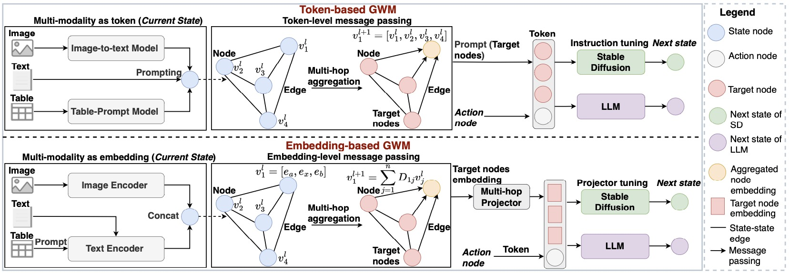

# Graph World Model

<p align="center">
    <a href="https://ulab-uiuc.github.io/GraphRouter/">
        
    </a>
    <a href="http://arxiv.org/abs/2410.03834">
        
    </a>
    <a href="https://x.com/taofeng_uiuc/status/1914914682860695559">
        
    </a>
    <a href="https://github.com/ulab-uiuc/GraphRouter/blob/master/LICENSE">
        
    </a>
    <br>
    <a href="https://github.com/ulab-uiuc/GraphRouter">
        
    </a>
    <a href="https://github.com/ulab-uiuc/GraphRouter">
        
    </a>
    <a href="https://github.com/ulab-uiuc/GraphRouter">
        
    </a>
</p>


<p align="center">
    <a href="https://ulab-uiuc.github.io/GraphRouter/">🌐 Project Page</a> |
    <a href="http://arxiv.org/abs/2410.03834">📜 arXiv</a> |
    <a href="https://x.com/taofeng_uiuc/status/1914914682860695559">📮 Twitter Post</a>
<p>


<!--  -->

<div align="center">
  
</div>


## News


**[2025.01.22]** 🌟 **Graph World Model** is accepted for ICML 2025.


## 📌Preliminary


### Environment Setup

```shell
# create a new environment
conda create -n gwm python=3.10
conda activate gwm

# install pytorch. Modify the command to align with your own CUDA version.
pip3 install torch  --index-url https://download.pytorch.org/whl/cu118

# install related libraries
pip install -r requirements.txt

# install flash-attn
pip install flash-attn --no-build-isolation

# install pyg
pip install torch_geometric
pip install pyg_lib torch_scatter torch_sparse torch_cluster torch_spline_conv -f https://data.pyg.org/whl/torch-2.1.0+cu118.html

```

### Dataset Preparation

First, generate 'data/unified_qa_data.csv'.

```bash
python data_processing/multidata_unify.py
```
Then, generate `data/router_data.csv` and `configs/llm_description_embedding.pkl` by setting your api_key in `configs/config.yaml`.

```bash
python data_processing/construct_router_data.py
```

For your convenience, we provide download links for the 'unified_qa_data.csv' and 'router_data.csv' files we generated. Please download them and put them in `data` folder.

[unified_qa_data.csv](https://drive.google.com/file/d/1__SY7UScvX1xPWeX1NK6ZulLMdZTqBcI/view?usp=share_link)
[router_data.csv](https://drive.google.com/file/d/1YYn-BV-5s2amh6mKLqKMR0H__JB-CKU4/view?usp=share_link)

## ⭐Experiments


### Training and Evaluation

Run experiments and print/save evaluation results on metrics Performance, Cost, and Reward. You can edit the hyperparameters in `configs/config.yaml` or using your own config_file.


```bash
python run_exp.py --config_file [config]
```


## 📝 Acknowledgement

The implementation of **GWM** is built upon [LLaGA]([https://github.com/PKU-Alignment/veRL](https://github.com/VITA-Group/LLaGA)) and [LLaVA]([[https://github.com/PKU-Alignment/veRL](https://github.com/VITA-Group/LLaGA](https://github.com/haotian-liu/LLaVA))).

We sincerely appreciate the efforts of these teams for their contributions to open-source research and development.

## Citation

```bibtex
@inproceedings{fenggraph,
  title={Graph World Model},
  author={Feng, Tao and Wu, Yexin and Lin, Guanyu and You, Jiaxuan},
  booktitle={Forty-second International Conference on Machine Learning}
}
```


<!-- <picture>
<source media="(prefers-color-scheme: dark)" srcset="https://api.star-history.com/svg?repos=ulab-uiuc%2FGraphEval&theme=dark&type=Date">

</picture> -->
